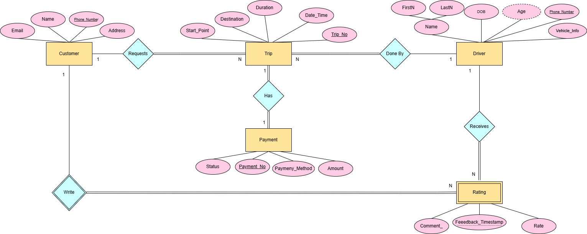

# Uber-like Database System (Oracle SQL)

## Overview
This repository contains a group academic project developed for a database course.  
The project models a simplified Uber-like system using Oracle SQL, focusing on relational database design and implementing main SQL queries to retrieve, analyze, and manage data.  
This project is created for educational purposes only.

## Database Entities
- Customer
- Driver
- Trip
- Payment
- Rating

## Main Queries Implemented
- Retrieve driver and rating information using JOIN operations
- Filter drivers based on age using WHERE and Oracle date functions
- Perform GROUP BY and HAVING queries to analyze ratings
- Apply aggregation functions such as MAX, AVG, and COUNT
- Use nested queries to compare payment amounts against averages
- Combine results using UNION
- Modify data using UPDATE and DELETE statements

## Key Concepts Applied
- Relational schema design with primary and foreign keys
- Data integrity and constraints
- Writing efficient and meaningful main SQL queries
- Oracle SQL built-in functions

## Important Note
This project was completed as a group academic project as part of university coursework.

## ERD Diagram
## ERD Diagram

